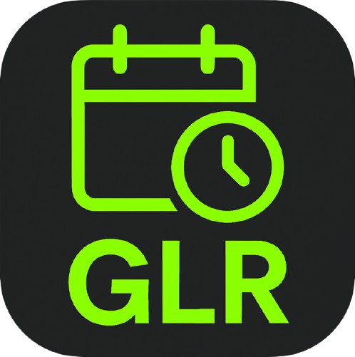

# 📱 GLR Agenda App

<div align="center">
  
  
  **Een moderne, Interactieve agenda-app voor studenten**
  
  [](https://reactnative.dev/)
  [](https://expo.dev/)
  [](https://www.typescriptlang.org/)
  [](https://www.nativewind.dev/)
</div>

---

## ✨ Overzicht

GLR Agenda is een moderne, intuïtieve mobiele applicatie ontworpen voor studenten om hun rooster en agenda eenvoudig te beheren. Met een stijlvolle zwart-groene interface en gebruiksvriendelijke functionaliteiten helpt de app je georganiseerd te blijven.

## 🖼️ Showcase
<div align="center">
   
   <p><em>Live demo van de GLR Agenda App in actie</em></p>
</div>

### 🎯 Hoofdfuncties

- 📅 **Weekoverzicht**: Bekijk je rooster per dag met een elegante datumkiezer
- ➕ **Handmatig toevoegen**: Voeg eenvoudig lessen, opdrachten, tentamens en afspraken toe
- 🗂️ **Categorieën**: Onderscheid verschillende soorten evenementen met kleurcodering
- 💾 **Lokale opslag**: Al je gegevens worden veilig lokaal opgeslagen
- 🌙 **Dark theme**: Moderne donkere interface die prettig is voor de ogen
- 📊 **Statistieken**: Overzicht van totaal aantal items en aankomende evenementen

## 🚀 Aan de slag

### Vereisten

- Node.js (versie 18 of hoger)
- npm of yarn
- Expo CLI
- Expo Go app op je telefoon (optioneel)

### Installatie

1. **Clone de repository**
   ```bash
   git clone https://github.com/jouw-gebruikersnaam/glragenda.git
   cd glragenda
   ```

2. **Installeer dependencies**
   ```bash
   npm install
   ```

3. **Start de development server**
   ```bash
   npx expo start
   ```

4. **Open de app**
   - **iOS Simulator**: Druk op `i` in de terminal
   - **Android Emulator**: Druk op `a` in de terminal
   - **Fysiek apparaat**: Scan de QR-code met de Expo Go app

## 🏗️ Project Structuur

```
glragenda/
├── app/                          # Hoofdapp schermen (Expo Router)
│   ├── _layout.tsx              # Root layout met splash screen
│   ├── index.tsx                # Hoofdpagina
│   └── +not-found.tsx           # 404 pagina
├── components/                   # Herbruikbare componenten
│   ├── AgendaItem.tsx           # Agenda item component
│   ├── DatePicker.tsx           # Datumkiezer component
│   ├── AddItemModal.tsx         # Modal voor nieuwe items
│   └── SplashScreen.tsx         # Laadscherm
├── assets/                       # Statische bestanden
│   ├── images/
│   │   └── GLRLOGO.png          # GLR logo
│   └── fonts/
│       └── SpaceMono-Regular.ttf
├── constants/                    # App constanten
│   └── Colors.ts                # Kleurendefinities
├── hooks/                        # Custom React hooks
└── styles/                       # Globale styling
```

## 🎨 Design Systeem

### Kleuren
- **Primair Groen**: `#22c55e` - GLR merkkleur voor accent elementen
- **Achtergrond**: `#000000` - Hoofdachtergrond voor modern uiterlijk
- **Surface**: `#1f2937` - Kaartachtergronden en panels
- **Tekst**: Wit/grijs varianten voor hiërarchie en leesbaarheid

### Componenten
- **SplashScreen**: Geanimeerd laadscherm met GLR logo
- **AgendaItem**: Moderne kaarten met statusbadges en pictogrammen
- **DatePicker**: Horizontale weekweergave met vandaag highlighting
- **AddItemModal**: Stijlvolle modal voor het toevoegen van evenementen

## 🛠️ Technologieën

| Technologie | Versie | Beschrijving |
|-------------|---------|--------------|
| **React Native** | 0.79.4 | Cross-platform mobiele ontwikkeling |
| **Expo** | ~53.0.12 | Ontwikkelplatform en tools |
| **TypeScript** | ~5.8.3 | Type-veilige ontwikkeling |
| **NativeWind** | ^4.1.23 | Tailwind CSS voor React Native |
| **Expo Router** | ~5.1.0 | Bestandsgebaseerde routing |
| **AsyncStorage** | 2.1.2 | Lokale data opslag |

## 📱 Functies in Detail

### 📅 Agenda Management
- **Dagweergave**: Bekijk al je evenementen voor een specifieke dag
- **Weeknavigatie**: Scroll door de komende 7 dagen
- **Tijdsortering**: Evenementen automatisch gesorteerd op tijd

### ➕ Evenement Toevoegen
- **Verschillende types**: Les, Opdracht, Tentamen, Afspraak
- **Verplichte velden**: Titel, Vak, Tijd
- **Optionele velden**: Locatie
- **Kleurcodering**: Elk type heeft een unieke kleur

### 🎯 Evenement Types
- 🎓 **Les** (Groen): Reguliere lessen en colleges
- 📝 **Opdracht** (Geel): Inleverdatums en deadlines
- 📋 **Tentamen** (Rood): Toetsen en examens
- 👥 **Afspraak** (Blauw): Meetings en besprekingen

### 📊 Dashboard Features
- **Totaal items**: Overzicht van alle agenda items
- **Aankomende**: Aantal toekomstige evenementen
- **Lege staat**: Vriendelijke boodschap wanneer er geen items zijn

## � Development

### Scripts
```bash
# Start development server
npx expo start

# Start voor Android
npx expo start --android

# Start voor iOS
npx expo start --ios

# Start voor web
npx expo start --web

# Lint code
npm run lint

# Reset project
npm run reset-project
```

### Code Kwaliteit
- **ESLint**: Geautomatiseerde code kwaliteitscontrole
- **TypeScript**: Strikte type checking
- **Prettier**: Consistente code formatting (aanbevolen)

## 📦 Build & Deployment

### Development Build
```bash
npx expo install --fix
npx eas build --profile development --platform ios
npx eas build --profile development --platform android
```

### Production Build
```bash
npx eas build --profile production --platform all
```


<div align="center">
   <p><strong>Gemaakt met ❤️ voor GLR studenten</strong></p>
   <p><em>© 2025 GLR Agenda App. Alle rechten voorbehouden.</em></p>
</div>

## 👥 Ontwikkelaars

<div align="center">
   <a href="https://github.com/SebasGLR">
      
   </a>
   <br>
   <strong><a href="https://github.com/SebasGLR">@SebasGLR</a></strong>
   <br>
   <em>Mede-ontwikkelaar</em>
</div>
